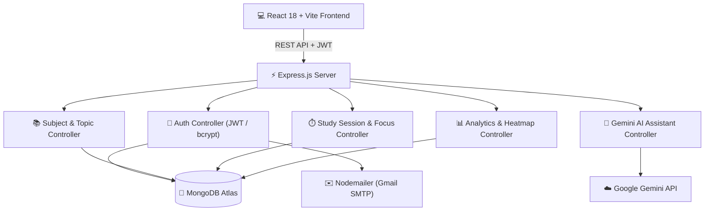

<div align="center">

# 🎓 PrepGenius AI

### *Next-Generation AI-Powered Exam Preparation & Intelligent Study Planner*

[](https://nodejs.org/)
[](https://expressjs.com/)
[](https://react.dev/)
[](https://vitejs.dev/)
[](https://www.mongodb.com/)
[](https://ai.google.dev/)
[](https://tailwindcss.com/)
[](#-license)

---

**PrepGenius AI** is a full-stack, AI-driven study productivity and exam preparation platform designed to help students streamline subject management, generate dynamic study schedules, track topic-level progress, execute focused Pomodoro sessions, and interact with an AI exam tutor in real time.

[Key Features](#-key-features) • [Tech Stack](#-tech-stack) • [System Architecture](#-system-architecture) • [Getting Started](#-getting-started) • [API Documentation](#-api-documentation) • [Project Structure](#-project-structure)

</div>

---

## 🌟 Key Features

### 🤖 1. AI Assistant & Dynamic Study Schedule Generator
- **Gemini AI Integration**: Uses `@google/generative-ai` to generate tailored daily study schedules based on exam dates, difficulty levels, target hours, and topic coverage.
- **Context-Aware Study Coach**: Conversational assistant that analyzes your enrolled subjects, remaining unmastered topics, and upcoming exam deadlines to offer hyper-relevant study advice and concept explanations.

### 🎯 2. Subject & Topic Hierarchy Management
- **Subject Dashboard**: Organize subjects with custom color tags, target exam dates, and priority indicators.
- **Topic-Level Tracking**: Break down subjects into individual topics. Track mastery percentage ($0\% - 100\%$), difficulty levels (*Easy*, *Medium*, *Hard*), status flags (*To-Do*, *In-Progress*, *Completed*), and revision tags.

### ⏱️ 3. Pomodoro Focus Timer & Ambient Focus Mode
- **Interactive Focus Timer**: Customizable work and break intervals.
- **Focus Room Visualizer**: Ambient canvas particle background, mascot study companions, active task attachment, and completion audio/toast notifications.
- **Session Logging**: Automatically saves focus session durations to the database to calculate total study time and streak metrics.

### 📊 4. Real-Time Progress Analytics & Heatmap
- **Dashboard Overview**: Metrics displaying total focus hours, completed topics, active study streak, and subject breakdown.
- **Activity Heatmap**: GitHub-style daily study heatmap visualizer tracking focus distribution across weeks and months.

### 🔐 5. Robust Multi-Method Authentication
- **JWT & Password Security**: Password hashing via `bcryptjs` and stateless JSON Web Token (JWT) route protection.
- **Google OAuth Sign-In**: Seamless social authentication via Google Sign-In SDK.
- **OTP Password Recovery**: Forgot password flow with OTP email generation sent using `Nodemailer`.
- **Account Management**: Profile updates, password modification, and account deletion with data cleanup.

### ⚡ 6. Modern SaaS UI & Design System
- **Dynamic Dark/Light Mode**: Smooth CSS variable injection for real-time theme customization.
- **Command Palette (`Ctrl+K` / `Cmd+K`)**: Rapid keyboard navigation across pages, actions, and study tools.
- **Interactive Micro-Animations**: Smooth page transitions, particle network backgrounds, animated progress indicators, and custom cursor toggle.

---

## 🛠️ Tech Stack

### Frontend
- **Framework**: React 18 (Vite 7)
- **Styling**: Tailwind CSS, Custom CSS Variables, Glassmorphism
- **Icons & UI**: Lucide React (`lucide-react`)
- **State & Context**: React Context API (`AuthContext`, `ThemeContext`, `ToastContext`)

### Backend
- **Runtime**: Node.js
- **Framework**: Express.js 5.0
- **Database**: MongoDB Atlas via Mongoose ODM
- **AI Service**: Google Generative AI SDK (`@google/generative-ai`)
- **Authentication**: `jsonwebtoken` (JWT), `bcryptjs`, Google OAuth
- **Email Service**: `Nodemailer`

---

## 📐 System Architecture



---

## 📁 Project Structure

```
PrepGenius-AI/
├── client/                     # React + Vite Frontend Application
│   ├── public/                 # Static assets & favicons
│   ├── src/
│   │   ├── assets/             # Branding & image assets
│   │   ├── components/         # Reusable UI components (Navbar, CommandPalette, Toaster, Cursor, Heatmap)
│   │   ├── context/            # Auth, Theme & Toast Providers
│   │   ├── pages/              # Landing, Auth, Dashboard, Subjects, Topics, StudyPlan, FocusTimer, AIAssistant, Analytics
│   │   ├── services/           # Axios API services & HTTP handlers
│   │   ├── App.jsx             # Main Router & Route Guards
│   │   ├── main.jsx            # React root entry point
│   │   └── index.css           # Global Design System & Utility classes
│   ├── index.html              # HTML shell
│   ├── vite.config.js          # Vite Configuration
│   ├── tailwind.config.js      # Tailwind Configuration
│   └── package.json            # Frontend dependencies
│
├── server/                     # Express.js Node.js Backend API
│   ├── config/                 # Database connection setup
│   ├── controllers/            # Controller logic (Auth, Subjects, Topics, AI, Analytics, Sessions)
│   ├── middleware/             # JWT authentication middleware
│   ├── models/                 # Mongoose Data Schemas (User, Subject, Topic, Task, Session, Analytics)
│   ├── routes/                 # API Routes (auth, subjects, topics, study-plan, tasks, sessions, analytics, assistant)
│   ├── utils/                  # Helper functions (OTP generator, Email template sender)
│   ├── server.js               # Main Express app & server entry point
│   ├── .env.example            # Backend Environment Template
│   └── package.json            # Backend dependencies
│
├── .gitignore                  # Git ignore specifications
├── package.json                # Root package configuration
└── README.md                   # Project Documentation
```

---

## 🚀 Getting Started

Follow these steps to set up and run **PrepGenius AI** on your local machine.

### Prerequisites
- **Node.js** (v18.0.0 or higher)
- **npm** (v9.0.0 or higher)
- **MongoDB Database**: Local MongoDB instance or free [MongoDB Atlas Cluster](https://www.mongodb.com/cloud/atlas)
- **Google Gemini API Key**: Obtain a free API key from [Google AI Studio](https://aistudio.google.com/)

---

### Step 1: Clone the Repository

```bash
git clone https://github.com/VanshMiglani007/prepgenius-ai.git
cd prepgenius-ai
```

---

### Step 2: Configure Backend Environment

1. Navigate to the root/server directory:
   ```bash
   cd server
   ```
2. Create a `.env` file from `.env.example`:
   ```bash
   cp .env.example .env
   ```
3. Update `.env` with your credentials:
   ```env
   # MongoDB Atlas Connection String
   MONGO_URI=mongodb+srv://<username>:<password>@cluster0.mongodb.net/prepgenius?retryWrites=true&w=majority

   # Port configuration
   PORT=5000

   # JWT Secret Key
   JWT_SECRET=your_super_secret_jwt_key_here

   # Google Gemini AI API Key
   AI_API_KEY=your_google_gemini_api_key

   # SMTP Configuration for Password Reset (Gmail App Password)
   SMTP_EMAIL=your_email@gmail.com
   SMTP_PASSWORD=your_gmail_app_password
   ```

---

### Step 3: Configure Frontend Environment

1. Navigate to the `client` directory:
   ```bash
   cd ../client
   ```
2. Create a `.env` file from `.env.example`:
   ```bash
   cp .env.example .env
   ```
3. Add your Google OAuth Client ID:
   ```env
   VITE_GOOGLE_CLIENT_ID=your_google_oauth_client_id.apps.googleusercontent.com
   ```

---

### Step 4: Install Dependencies & Run

#### Install Backend & Root Dependencies:
From the root project directory:
```bash
npm install
```

#### Install Frontend Dependencies:
```bash
cd client
npm install
cd ..
```

#### Start Development Servers:

- **Option A**: Run Backend and Frontend separately:
  - **Backend Server**: `npm run dev` (Runs on `http://localhost:5000`)
  - **Frontend Server**: `cd client && npm run dev` (Runs on `http://localhost:5173`)

- **Option B**: Production Build & Serve:
  ```bash
  cd client && npm run build && cd ..
  npm start
  ```

---

## 📡 API Documentation

### 🔑 Authentication Routes (`/api/auth`)
| Method | Endpoint | Description | Access |
| :--- | :--- | :--- | :--- |
| `POST` | `/api/auth/signup` | Register a new user | Public |
| `POST` | `/api/auth/login` | Authenticate user & issue JWT | Public |
| `POST` | `/api/auth/google` | Sign-in / Register with Google OAuth | Public |
| `POST` | `/api/auth/forgot-password` | Send password reset OTP email | Public |
| `POST` | `/api/auth/verify-otp` | Verify OTP code | Public |
| `POST` | `/api/auth/reset-password` | Reset password using OTP verification token | Public |
| `GET` | `/api/auth/profile` | Retrieve user profile | Private |
| `POST` | `/api/auth/update-profile` | Update profile details (Name, Target Exam, Daily Goal) | Private |
| `POST` | `/api/auth/change-password` | Change account password | Private |
| `POST` | `/api/auth/delete-account` | Delete user account and associated data | Private |

### 📚 Subject & Topic Routes (`/api/subjects`, `/api/topics`)
| Method | Endpoint | Description | Access |
| :--- | :--- | :--- | :--- |
| `GET` | `/api/subjects` | Fetch all user subjects | Private |
| `POST` | `/api/subjects` | Create a new subject | Private |
| `PUT` | `/api/subjects/:id` | Update subject details | Private |
| `DELETE` | `/api/subjects/:id` | Delete a subject and its topics | Private |
| `GET` | `/api/topics` | Fetch all topics across subjects | Private |
| `GET` | `/api/topics/:subjectId` | Fetch topics for a specific subject | Private |
| `POST` | `/api/topics` | Create a new sub-topic | Private |
| `PUT` | `/api/topics/:id` | Update topic status, mastery level, revision flag | Private |
| `DELETE` | `/api/topics/:id` | Delete a topic | Private |

### 🤖 AI Assistant & Planner (`/api/assistant`, `/api/study-plan`)
| Method | Endpoint | Description | Access |
| :--- | :--- | :--- | :--- |
| `POST` | `/api/assistant/chat` | Chat with PrepGenius Gemini AI Assistant | Private |
| `POST` | `/api/study-plan/generate` | Generate AI customized study schedule | Private |
| `POST` | `/api/tasks/from-plan` | Convert AI study plan items into actionable tasks | Private |

### ⏱️ Focus Sessions & Analytics (`/api/sessions`, `/api/analytics`)
| Method | Endpoint | Description | Access |
| :--- | :--- | :--- | :--- |
| `POST` | `/api/sessions/start` | Start a new study/pomodoro session | Private |
| `PUT` | `/api/sessions/:id/end` | End session & log completed duration | Private |
| `GET` | `/api/sessions` | Fetch past study session log history | Private |
| `GET` | `/api/analytics/dashboard` | Fetch aggregated user stats & progress | Private |
| `GET` | `/api/analytics/daily` | Fetch daily focus time activity heatmap data | Private |

---

## 👤 Author

**Vansh Miglani**
- **GitHub**: [@VanshMiglani007](https://github.com/VanshMiglani007)
- **Repository**: [prepgenius-ai](https://github.com/VanshMiglani007/prepgenius-ai)

---

## 📄 License

This project is licensed under the [ISC License](LICENSE).

```
Copyright (c) 2026 Vansh Miglani
```
